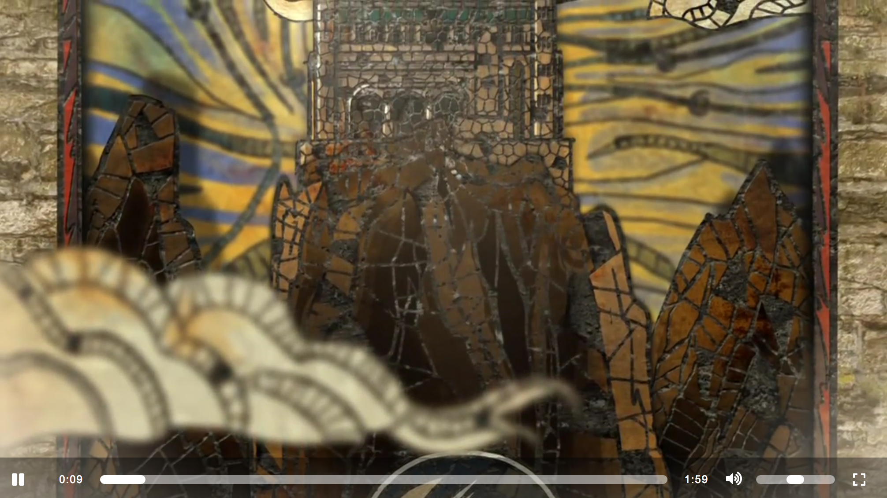

# Game of Thrones Video App
### Assignment for Multimedia Authoring 1 MMED 1005

A HTML5 flat and clean video player app built with Javascript and CSS3.

## Features
- Includes an HTML5 video player with custom controls.
- Uses native HTML5 form controls for volume (range input).
- No dependencies. Written in "vanilla" JavaScript.
- Full screen support

## Browser Support
- Chrome
- Safari
- Firefox
- Internet Explorer 10+.

## Known Issues
- Not Responsive

## Resources
- Icons: [Font Awesome](http://www.fontawesome.com)

## Technologies used
- HTML `<video>` tag
- CSS3
- Javascript

## Authors
- Julliana Bauer
